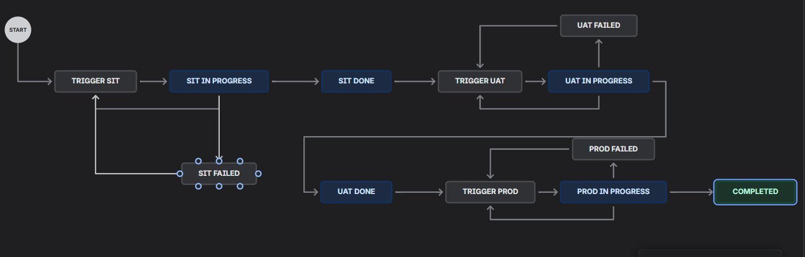

# Jira Cloud Setup for the RoboShop Release Pipeline

This is the companion doc to the release-pipeline sections of [[jenkins]] — everything on the **Jira side** needed for `nodejsEKSMain.groovy` to work: the Space, the custom fields, the workflow, and the Automation rules that call Jenkins.

**Terminology note:** newer Jira Cloud UIs have renamed things — what used to be a **Project** is now a **Space**, and what used to be an **Issue** is now a **work item**. Use the new names when navigating the UI. But the old names haven't actually gone away underneath: the REST API is still `/rest/api/2/issue/...`, admin screens still say "Issue Type" and "custom field", and `jira-steps-plugin` still talks about issues. Expect both vocabularies in the same setup — that's not a mistake, it's the UI relabelling a still-classic backend.

## 1. Sign Up / Free Trial

1. Go to `https://www.atlassian.com/software/jira` → **Get it free**.
2. Create a site — this gives you a subdomain like `yourteam.atlassian.net` (the roboshop training instance is `joindevops.atlassian.net`).
3. The free tier is enough for this whole setup: one Space, custom fields, workflows, and Automation rules with webhook actions are all included.

## 2. Create a Space

1. Left sidebar → **Spaces** → **+** (Create space).
2. Pick a software-development template (Kanban/Scrum both work — the pipeline only cares about statuses and transitions, not the board layout).
3. Name it (e.g. `daws-90s`) and give it a **key** (e.g. `DAWS90S`) — the key is what shows up in every ticket ID (`DAWS90S-9`) and is the `jiraProjectKey` value `nodejsEKSMain.groovy` passes to `createJiraTicket()`.

## 3. Custom Fields

The pipeline needs three fields Jira doesn't have by default, to carry the release's identity on the ticket:

| Field name | Holds | Set by |
|------------|-------|--------|
| `Commit ID` | The full git commit SHA being released | `create-jira-ticket` stage, on ticket creation |
| `Version` | The app version (from `package.json`) | `create-jira-ticket` stage, on ticket creation |
| `CR Number` | The Change Request number | A transition screen, filled in by the release owner when moving to `Trigger PROD` |

To create one: **Space settings → Issues (or Fields) → Custom fields → Create custom field** → type **Short text**, name it exactly `Commit ID` (or `Version`, `CR Number`), then add it to the screens your issue type uses.

**Exact spelling matters, but exact ID doesn't.** `utils.groovy`'s `createJiraTicket()` looks these fields up **by name** at runtime (`jiraGetFields()`, matched case-insensitively) rather than hardcoding a `customfield_XXXXX` number — so the field survives being recreated on a different site, but if you typo the field *name* itself, the pipeline fails with "Could not find the 'Commit ID' / 'Version' custom fields on this Jira site."

## 4. Workflow: Statuses & Transitions

This is the core of the whole integration — the workflow *is* the state machine the pipeline drives. Build exactly this shape:



To build it: **Space settings → Workflows** → edit the workflow → the diagram editor lets you add statuses and drag transitions between them.

**Why a dedicated `X Failed` status per environment, instead of looping the failure straight back to `Trigger X`:** every `Trigger *` status has an Automation rule sitting on it that fires the Jenkins webhook (below). If a failed build transitioned itself straight back onto `Trigger SIT`, that transition would immediately re-fire the same rule and re-run the build with no human involved — an accidental auto-retry loop. Routing failures through an intermediate `X Failed` status means only a person clicking `Retrigger X` can put the ticket back on a `Trigger *` status. This is exactly the design point where a "just loop it back" first draft would go wrong.

**Publish it.** Jira's workflow editor saves changes as a **draft** — the diagram updates immediately, but real tickets keep using the old live workflow until you explicitly click **Publish** (top-right) and confirm. Skipping this is a genuine, easy-to-hit mistake: the diagram looks right, the transition you need looks like it's there, but Jenkins still gets "No available transition to status 'X'" because it's talking to the still-live old workflow.

### Name the three "Failed" statuses consistently

Type all three exactly as **`SIT Failed`**, **`UAT Failed`**, **`PROD Failed`** — Title Case, matching the existing `X Done` / `X In Progress` naming already in the workflow. There's no dropdown or auto-complete for this; it's free text, so keeping one consistent convention across all three from the start avoids a real class of bug entirely.

**Why this matters more than it looks like it should:** the code matches Jira transitions by the **destination status's exact name** (`transitionJiraIssue()` in `utils.groovy`), and Jira does not normalize what you type. If the statuses end up typed inconsistently — say `SIT FAILED` in one session and `PROD failed` in another — the pipeline code has to match each one individually, character for character. Worse, a mismatch doesn't fail the build: `safeTransitionJiraIssue()` is deliberately best-effort, so it only logs a warning in the Jenkins console while the ticket silently stops tracking reality. Naming them consistently up front is what avoids ever hitting this.

If you ever do need to check what a status is *actually* named on a real ticket (e.g. copying this setup onto a new site, or debugging a "no available transition" warning), ask Jira directly rather than guessing from the UI — status chips are rendered all-caps regardless of the real stored name:

```
curl -u YOUR_EMAIL:YOUR_API_TOKEN \
  "https://yourteam.atlassian.net/rest/api/2/issue/DAWS90S-9/transitions"
```

This returns every transition available *from the ticket's current status*, each with the transition's real `to.name` — compare that string against what the Groovy code passes to `safeTransitionJiraIssue()`.

## 5. Retry Loops

Each environment's failure path needs a `Retrigger X` transition from `X Failed` back to `Trigger X` — this is the release owner's manual retry button. Add it in the same workflow editor pass as the statuses above.

## 6. The CR Number Screen

`CR Number` should only be asked for once — when a ticket is actually being promoted to PROD, not on every ticket. Attach it to a **transition screen** on whichever transition leads into `Trigger PROD`:

1. In the workflow editor, select that transition.
2. Add (or reuse) a **screen**, and add the `CR Number` field to it.
3. Now moving a ticket to `Trigger PROD` pops a small form asking for the CR number before the transition completes — the release owner fills it in right there, and Jira Automation reads it straight off the ticket afterward.

(Screen behavior varies a little between team-managed and company-managed Space types — if your Space doesn't expose a classic "screen" picker on the transition, look for the equivalent "fields to show" option on that transition's settings instead.)

## 7. Automation Rules

Three rules, one per environment, all the same shape — **Space settings → Automation → Create rule**:

| Rule | Trigger | Action 1 | Action 2 |
|------|---------|----------|----------|
| `sit` | Issue transitioned → to `Trigger SIT` | Transition to `SIT In Progress` | Send web request → Jenkins |
| `uat` | Issue transitioned → to `Trigger UAT` | Transition to `UAT In Progress` | Send web request → Jenkins |
| `prod` | Issue transitioned → to `Trigger PROD` | Transition to `PROD In Progress` | Send web request → Jenkins |

**The trigger must be "Issue transitioned," never "Work item created."** A rule that fires on ticket creation has no gate at all — the instant `create-jira-ticket` opens the ticket, SIT would start with nobody having reviewed or approved anything. "Issue transitioned → to Trigger X" only fires when something (a human clicking the button, or the `Retrigger X` transition) actually moves the ticket onto that status — which is exactly the manual gate the pipeline is designed around for SIT/UAT/PROD alike.

### The "Send web request" action

- **URL**: `http://jenkins.daws90s.shop:8080/generic-webhook-trigger/invoke?token=<jira-secret value>` (the token matches the `jira-secret` Secret text credential configured in Jenkins — see [[jenkins]]).
- **Method**: POST
- **Custom data (JSON)**, using Jira Automation's smart values to pull real ticket data in:

```json
{
  "ENVIRONMENT": "sit",
  "COMMIT_ID": "{{issue.Commit ID}}",
  "COMPONENT": "catalogue",
  "PROJECT": "roboshop",
  "ISSUE_KEY": "{{issue.key}}"
}
```

The `prod` rule's payload additionally includes `"VERSION": "{{issue.Version}}"` and `"CR_NUMBER": "{{issue.CR Number}}"`, matching the fields `GenericTrigger`'s `genericVariables` pulls out on the Jenkins side.

## 8. Creating API Tokens & the `jira-creds` Credential

1. `https://id.atlassian.com/manage-profile/security/api-tokens` → **Create API token**.
2. In Jenkins: **Manage Jenkins → Credentials → Add Credentials**. **Kind**: `Username with password`. **Username**: your Jira account email. **Password**: the API token from step 1 — **not** your actual Jira login password. **ID**: `jira-creds`.
3. **Manage Jenkins → System → JIRA Steps** → add a site (e.g. `roboshop-jira`), its URL, and select the `jira-creds` credential — this is what every `jira*` pipeline step in `utils.groovy` authenticates with.

**This exact shape matters — email as username, API token as password — or Jira silently refuses to create issues.** Any other combination (account password instead of the token, or the token alone without the email as username) fails ticket creation, so get this one right before testing anything downstream.

The same token also works standalone for ad-hoc debugging — `curl -u email:token ...` against any Jira REST endpoint — which is exactly how the "no available transition" warnings earlier get diagnosed without adding any logging to the pipeline.

## Quick Reference

| Concept | One-liner |
|---------|-----------|
| **Space** | New name for what used to be called a Project |
| **Work item** | New name for what used to be called an Issue — the REST API and plugins still say "issue" |
| Custom fields needed | `Commit ID`, `Version` (set on ticket creation), `CR Number` (set via a transition screen) |
| Field lookup | By **name**, case-insensitive, at runtime — not by hardcoded `customfield_XXXXX` |
| **Workflow = state machine** | The statuses/transitions Jira has *are* what the pipeline drives — not just decoration |
| Why `X Failed` statuses exist | Prevents an auto-retry loop — only a human clicking `Retrigger X` reaches `Trigger X` again |
| **Publish** | Workflow edits are a draft until published — real tickets ignore unpublished changes |
| Failed status naming | Type all three consistently: `SIT Failed`, `UAT Failed`, `PROD Failed` — Title Case, no exceptions |
| Status name matching | Exact string match, case-sensitive, on whatever was actually typed when the status was created |
| Debugging technique | `curl -u email:token .../rest/api/2/issue/KEY/transitions` — shows real transitions + exact status names |
| Automation trigger | **Issue transitioned → to Trigger X** — never "Issue/Work item created" (no gate) |
| Webhook URL | `.../generic-webhook-trigger/invoke?token=<jira-secret>` — POST, JSON body, smart values pull field data |
| **`jira-creds`** | Username with password: email as username, **API token** as password — wrong shape = Jira refuses to create issues |
| API token | Generated once at id.atlassian.com; used both as `jira-creds`' password and for ad-hoc `curl` debugging |

---
